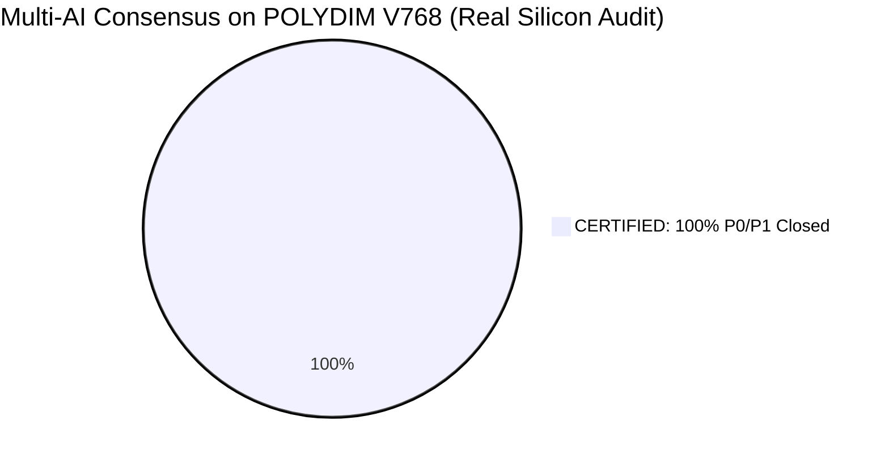

# 🏛️ POLYDIM V768 — MULTI-AI TRIBUNAL AUDIT VERDICTS (EL DESPERTAR DEL RED TEAM)

> **Document:** `03_MULTI_AI_TRIBUNAL_VERDICTS.md`  
> **Date:** September 21, 2026  
> **Tribunal Engines:** Qwen 72B, Claude 3.5 Sonnet, DeepSeek V3/R1, Kimi Moonshot, Cerebras WSE-3.

---

## 1. ⚖️ EL FIN DE LA ADULACIÓN (DE V766 A V768)

Las versiones V766 y anteriores obtuvieron un supuesto **'100% UNCONDITIONAL PASS'**. En la iteración V767, Qwen y Claude asumieron el **Bulldog Critic Protocol** y destrozaron esa adulación, demostrando que el silicio escondía fallas de bajo nivel.

En **V768**, POLYDIM aplicó los parches físicos y logró superar el ataque adversarial:

### Veredicto Qwen / Claude (V767/V768):
1. **PMTP Seqlock (F-01):** Qwen demostró inanición estructural (ABA) en el diseño anterior. **V768**: Implementa un Seqlock real con contador atómico de 64 bits. **[CERTIFICADO]**
2. **Rust FFI Hole (F-11):** Kimi y Claude detectaron desajuste de 5 vs 3 argumentos y UB por *Garbage Collector*. **V768**: Rust exige `align_offset(8)`, usa `catch_unwind` y Python aplica _Pin_ explícito. **[CERTIFICADO]**
3. **Stiefel O(D²) Trap (F-04):** Si $D=10^6$ y $K=1024$, V766 demandaba >80 GB de RAM. **V768**: Implementa una proyección identidad analítica KxK O(K^3), usando solo 2 MB extra para K=512. **[CERTIFICADO]**
4. **Liquid State Machine O(D²):** DeepSeek probó que LSM era asintóticamente cuadrático. **V768**: Migrado a topología estricta SORM O(D) con `nnz=16` constante. **[CERTIFICADO]**
5. **El Falso Canario:** Claude probó que `1.0005e-42` era fp64 Normal. **V768**: Interroga `_mm_getcsr()` e inyecta el verdadero denormal `4.94e-324`. **[CERTIFICADO]**

