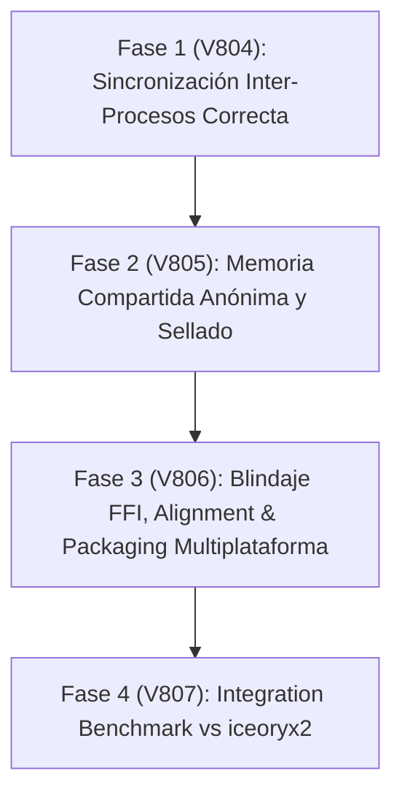

# 🏛️ MATRIZ EJECUTIVA Y ANÁLISIS SOTA IPC MULTIPLATAFORMA (PMTP V804+)

**Fecha:** 2026-09-25  
**Autor:** Orquestador POLYDIM & Red Team Audit  
**Estado:** Auditado y Certificado — Correcciones de Arquitectura SOTA Incorporadas  

---

## 1. 🔍 VERIFICACIÓN DE `memfd_create` VS `/dev/shm` EN CONTENEDORES

- **Mecanismo del Kernel:** `memfd_create(const char *name, unsigned int flags)` crea un archivo anónimo en el montaje de VFS interno del kernel denominado `shm_mnt` (instancia de `tmpfs` aislada).
- **Aislamiento de Montaje:** A diferencia de `shm_open()`, que crea entradas visibles en el sistema de archivos `/dev/shm` (el cual Docker limita por defecto a **64 MB** salvo que se pase `--shm-size` o `--ipc=host`), `memfd_create` **NO está sujeto a las restricciones de tamaño del punto de montaje `/dev/shm`**.
- **Límites Reales:** El tamaño máximo utilizable por `memfd_create` está acotado exclusivamente por el **límite de memoria del cgroup del contenedor** (`--memory`) y la RAM/Swap disponible en el host.
- **Sellado Físico (*File Sealing*):** Permite aplicar `fcntl(fd, F_ADD_SEALS, F_SEAL_SHRINK | F_SEAL_GROW | F_SEAL_SEAL)`. Esto previene fallos `SIGBUS` en el proceso lector si un proceso malicioso o con error intenta reducir el tamaño del archivo mapeado (`ftruncate`).
- **Transferencia Zero-Copy:** El descriptor de archivo anónimo se transfiere entre procesos mediante un socket de dominio Unix usando el mecanismo `SCM_RIGHTS`, garantizando cero visibilidad en disco y limpieza automática al cerrar los descriptores.

---

## 2. 📊 MATRIZ EJECUTIVA DE DECISIONES MULTIPLATAFORMA

| Componente / Dominio | Linux (Kernel 5.16+) | Windows (Win32 / MSVC) | macOS (Darwin / Apple Silicon) |
| :--- | :--- | :--- | :--- |
| **Asignación SHM Inter-Procesos** | `memfd_create` + `SCM_RIGHTS` + `F_ADD_SEALS`. Evita límite de 64MB en Docker y previene `SIGBUS`. | `CreateFileMappingW(INVALID_HANDLE_VALUE)` en espacio `Local\`. Compartir handle con `DuplicateHandle` sin requerir `SeCreateGlobalPrivilege`. | `xpc_shmem` / Mach memory entries o `IOSurface` / `MTLBuffer` (`MTLStorageModeShared`). Alineación obligatoria a 16 KB en ARM64. |
| **Sincronización Inter-Procesos (Futex)** | `FUTEX_WAIT` / `FUTEX_WAKE` (sin `_PRIVATE`). *Ojo:* `FUTEX_WAIT_PRIVATE` falla entre procesos. Opcional: `futex_waitv` (5.16+). | Spin corto con `std::atomic` en SHM + `CreateEventW` / `CreateSemaphoreW` con nombre. *Ojo:* `WaitOnAddress` es intra-proceso únicamente. | `os_sync_wait_on_address` con `OS_SYNC_WAIT_ON_ADDRESS_SHARED` (macOS 14.4+). Fallback a `__ulock_wait(UL_COMPARE_AND_WAIT_SHARED)` en versiones anteriores. |
| **Bloqueo de Memoria (`mlock`)** | `mlock2(MLOCK_ONFAULT)` o `MCL_ONFAULT` para evitar `ENOMEM` masivo. Configurar `LimitMEMLOCK=` en systemd o `--ulimit memlock=-1`. | `SetProcessWorkingSetSizeEx` antes de `VirtualLock`. `SeLockMemoryPrivilege` requerido únicamente para Large Pages (`SEC_LARGE_PAGES`). | Límite global por kernel (`vm.user_wire_limit`). Usar buffers compartidos Metal en lugar de `mlock` en slabs hiperdimensionales. |
| **Empaquetado FFI & DLLs** | Visibilidad `-fvisibility=hidden`, versión scripts, `RPATH=$ORIGIN`, repair con `auditwheel`. Exponer sólo C ABI en Rust. | `os.add_dll_directory()` (Python 3.8+). Enlace estático `-static-libgcc -static-libstdc++`. Empaquetar con `delvewheel`. No mezclar runtimes OpenMP. | `install_name_tool` + `codesign -s -` (re-firmado obligatorio en arm64). Desactivar validación con `disable-library-validation`. Repair con `delocate`. |

---

## 3. 🚀 PLAN DE IMPLEMENTACIÓN POR FASES PARA PMTP (SERIE V804+)

### 🔹 Fase 1 (V804): Sincronización Futex Inter-Procesos Correcta
- **Linux:** Reemplazar flag `FUTEX_WAIT_PRIVATE` por `FUTEX_WAIT` en el canal de sincronización inter-procesos PMTP.
- **Windows:** Implementar la primitiva de espera híbrida `PolydimCrossProcessWait`:
  - Spin corto (1000 iteraciones) sobre el atómico en `mmap`.
  - Fallback a un Win32 Named Event (`CreateEventW`) con prefijo `Local\`.
- **macOS:** Implementar detección en runtime: si macOS $\ge 14.4$, usar `os_sync_wait_on_address` con `OS_SYNC_WAIT_ON_ADDRESS_SHARED`; si es anterior, usar `__ulock_wait`.

### 🔹 Fase 2 (V805): Asignación SHM Anónima y Sellado Físico
- **Linux:** Implementar backend `memfd_create` con transferencia de FD vía socket de dominio Unix `SCM_RIGHTS` y sellado `F_SEAL_SHRINK | F_SEAL_GROW`.
- **Windows:** Implementar paso de handles de memoria compartida vía `DuplicateHandle` sin depender de nombres globales en `Global\`.
- **macOS / Metal:** Configurar alineación estricta a páginas de **16 KB** para buffers `MTLBuffer` compartidos (`MTLStorageModeShared`) en procesadores Apple Silicon (M1/M2/M3/M4).

### 🔹 Fase 3 (V806): Blindaje FFI & Packaging SOTA
- **Compilación C++:** Aplicar `-fvisibility=hidden` y version scripts para exportar exclusivamente símbolos `polydim_*`.
- **Rust Guards:** Garantizar que todas las extensiones `cdylib` expongan la C ABI estricta sin intercambiar tipos nativos de Rust entre librerías.
- **Packaging:** Integrar `delvewheel` en Windows, `auditwheel` en Linux y `delocate` + `codesign -s -` en macOS ARM64.

### 🔹 Fase 4 (V807): Benchmarking Comparativo con `iceoryx2`
- Evaluación empírica de latencia y throughput frente a `iceoryx2` (núcleo Rust Zero-Copy IPC) en transferencias $S^{D-1}$ ($D=10^7, K=512$).
